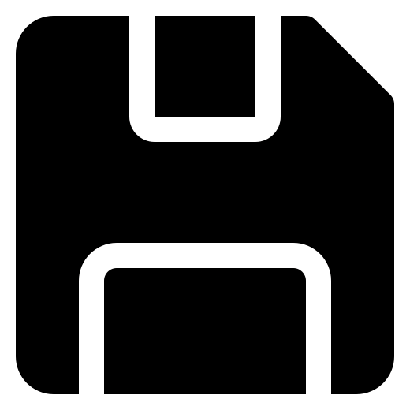
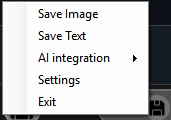
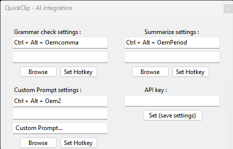
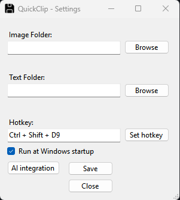

  

<h1 align="center">QuickClip</h1>

  <strong>A lightweight Windows clipboard manager with AI-powered tools — built for speed, simplicity, and productivity.</strong>

  
  

  <a href="#-screenshots">Screenshots</a>
  ·
  <a href="#-features">Features</a>
  ·
  <a href="#%EF%B8%8F-how-to-use">How to Use</a>
  ·
  <a href="#%EF%B8%8F-hotkeys">Hotkeys</a>
  ·
  <a href="#-installation">Installation</a>
  ·
  <a href="#-tech-stack">Tech Stack</a>
  ·
  <a href="#-about">About</a>
  ·
  <a href="#-license">License</a>

---

## 📸 Screenshots

| Tray icon settings | AI Integration | Settings |
|:------------------:|:--------------:|:----------:|
|  |  |  |

---

## 🧠 Features

- 📋 Save any text or image you copy anywhere on your system with a customizable hotkey  
- ⚡ Fully configurable hotkeys to access features instantly — no need to open the GUI  
- 🤖 Built-in AI assistant (Gemini integration) with the ability to copy
results directly to your clipboard
- 💾 Save and organize snippets, text, and images
- 🧩 Lightweight — uses almost **0% system resources**

---

## 🖱️ How to Use

1. **Run `QuickClip.msi`** to install the app.  
2. Launch QuickClip from the **system tray** (right-click the tray icon).  
3. Open **Settings** and set up:
   - Your save locations for **text** and **images**
   - Your **hotkey** for saving clipboard content
4. For **AI Tools**:
   - Click the **AI Integration** button  
   - Configure hotkeys for each AI feature and choose where to save results  
   - (You can use one shared folder or separate folders for each tool)
   - Set your Copy to clipboard preferences by checking the boxes in the AI Integration menu.
   - By doing so, the AI-generated content will be automatically copied to your clipboard after processing.
5. Go to **Google AI Studio → Dashboard → API Keys**  
   - Create a new key and paste it into the textbox in QuickClip  
6. Add any **custom prompt** you want in the "Custom Prompt" section — then you’re ready to go!

---

## ⚙️ Hotkeys

> You can set **any key combination** in the settings — fully customizable to your workflow.

---

## 📦 Installation

1. Download the latest release from [Releases](https://github.com/LumoRez07/QuickClip/releases)  
2. Run the installer `QuickClip vX.X.X.msi` and choose any location  
3. Launch `QuickClip.exe` from your chosen folder

---

## 🧰 Tech Stack

- **C# (.NET Framework / WinForms)**  
- **Google Gemini API**  
- **Windows API (Clipboard + Hotkeys)**  
- **Visual Studio 2022**

---

## 💬 About

Created by **[@LumoRez07](https://github.com/LumoRez07)**  
For feedback or bug reports, open an [issue](https://github.com/LumoRez07/QuickClip/issues).

---

## 📄 License

This project is licensed under the **MIT License**.

---

## A Note from the Developer

I'm a new developer, and this project is an important part of my learning journey.

While the MIT license gives you the freedom to use this code, I would be very grateful if you could provide attribution by linking back to this repository. Seeing my work being used and acknowledged is a huge motivation for me.

Thank you for your support!
  

